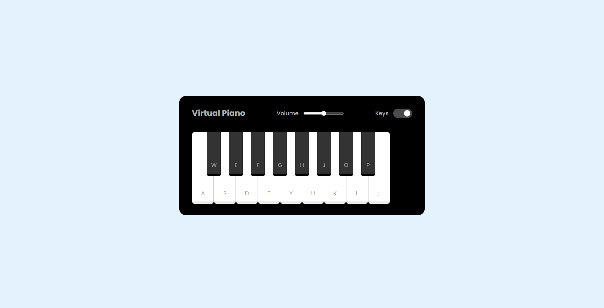

# JS-Virtual-Piano

Um simulador de piano virtual desenvolvido durante o desafio **"Construindo um Simulador de Piano com JavaScript"** da **DIO.me**. Este projeto faz parte do **Bootcamp Ri Happy - Front-end do Zero**.

## 🚀 Tecnologias Utilizadas

- **HTML**: Para estruturar o teclado do piano.  
- **CSS**: Para estilização e responsividade.  
- **JavaScript**: Para a lógica de funcionamento e reprodução de sons.

## 🖥 Preview

## 🔗 Links Úteis

- [Dio.me - Bootcamp Ri Happy - Front-end do Zero](https://web.dio.me/track/coding-future-front-end-do-zero)
- [Repósitorio original](https://github.com/felipeAguiarCode/js-music-keyboard-virtual)
